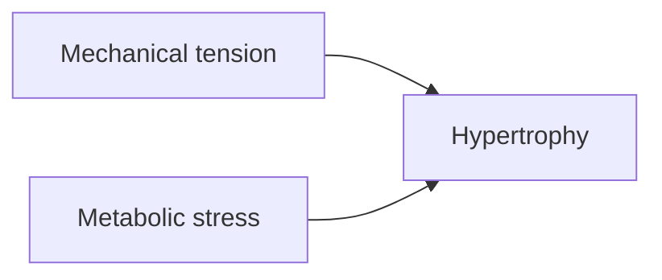

# Vault Format

The teaching workspace is an Obsidian vault, created by you at the start of the first session. One vault, one mission. This document covers how to set it up and which Obsidian features to use.

## Layout

```
MISSION.md
RESOURCES.md
GLOSSARY.md
INDEX.md
NOTES.md
lessons/0001-dash-case-name.md
reference/dash-case-name.md
learning-records/0001-dash-case-name.md
exercises/         # only when a lesson needs live grading
attachments/       # images, diagrams the user drops in
.obsidian/         # vault config, committed
```

Create directories lazily. A vault with one lesson does not need an `exercises/` folder.

## Creating the vault

Create the vault yourself on the first session:

1. `mkdir` a directory named in dash-case after the topic, and work inside it.
2. Write `MISSION.md`. Interview the user first if the mission is unclear - do not create the vault around a mission you guessed.
3. Write `INDEX.md` as the entry note.
4. Create `.obsidian/app.json` so links and attachments behave predictably:

```json
{
  "attachmentFolderPath": "attachments",
  "newLinkFormat": "shortest",
  "useMarkdownLinks": false,
  "alwaysUpdateLinks": true
}
```

5. Tell the user to open the directory in Obsidian with **Open folder as vault**, once.

`alwaysUpdateLinks` matters: it means renaming a note rewrites every link to it, so the vault does not rot as lesson titles change.

Do not install community plugins or write CSS snippets unless the user asks. Obsidian's built-in rendering is enough, and plugin dependencies make the vault non-portable.

### Adopting a vault the user already has

If the directory already has a `.obsidian/` but no `MISSION.md`, it is the user's own vault. Add the teaching files alongside their notes and leave everything else alone: no reorganising, no renaming, no restyling. Their `.obsidian/app.json` already exists - read it rather than overwriting it, and ask before changing a setting. If `useMarkdownLinks` is on, follow that convention instead of wiki-links so the vault stays internally consistent.

## Linking

Use `[[wiki-links]]` everywhere, never relative Markdown paths. Obsidian resolves them by note name regardless of folder, gives you backlinks for free, and shows the vault's structure in the graph view.

- Link to a note: `[[0003-progressive-overload]]`
- Link with display text: `[[0003-progressive-overload|progressive overload]]`
- Link to a heading: `[[rpe-scale#Reading the scale]]`
- Embed a note or section inline: `![[rpe-scale#Reading the scale]]`

Embedding is how a reference note gets reused across lessons without copy-paste. When two lessons need the same table, the table lives in `reference/` and both lessons embed it.

External citations stay as ordinary Markdown links.

## Callouts

Callouts carry the structure that used to need styling. The syntax is `> [!type]` on the first line, `-` after the type to start folded, `+` to start expanded.

```md
> [!question]- What does RPE 8 mean?
> Two reps left in the tank.
```

Use them consistently:

- `[!question]-` folded, for retrieval practice. The prompt shows, the answer hides.
- `[!tip]` for the single thing worth remembering from the lesson.
- `[!warning]` for a common mistake or misconception.
- `[!quote]` for verbatim material from a trusted source, with the citation.
- `[!example]` for worked examples.

Do not decorate. A lesson that is all callouts has no emphasis left.

## Diagrams

Anything with structure, sequence or flow gets a Mermaid block rather than a paragraph describing it.

````md

````

Keep diagrams small enough to read on a phone. Mermaid renders in both light and dark themes, so do not hardcode colours.

## Formulas

Inline maths is `$E = mc^2$`. Display maths is `$$…$$` on its own lines. Obsidian renders both with MathJax.

## Tasks

For lessons that walk the user through real-world steps, use task checkboxes so the note doubles as the checklist:

```md
- [ ] Hold downward dog for five breaths
- [ ] Step forward into low lunge
```

## Frontmatter

Every lesson and reference note gets minimal frontmatter:

```yaml
---
tags: [lesson]
created: 2026-09-11
---
```

Tags are `lesson`, `reference`, `learning-record`. Add topic tags only when the vault is large enough that search needs them. Resist adding more fields - anything you would put here is usually better said in `INDEX.md`.

## Interactive exercises

When a skill needs live grading or simulation a note cannot do, write one self-contained HTML file to `./exercises/` and link it from the lesson as an ordinary Markdown link:

```md
[Open the interval drill](exercises/0004-interval-drill.html)
```

Obsidian opens it in the browser. Keep it self-contained: no build step, no shared stylesheet, no external dependencies. If two exercises want to share code, that is a sign the loop belongs in the session with you instead.
